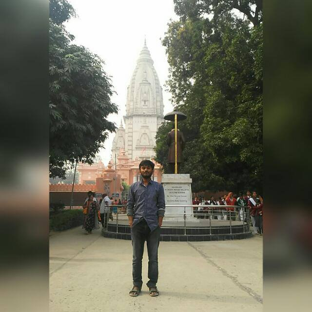
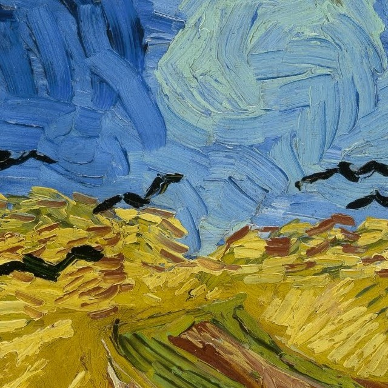
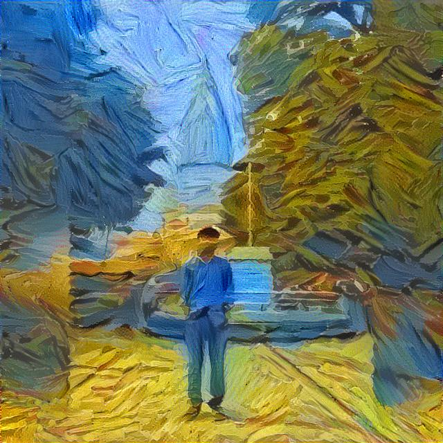

# Neural Style Transfer

TensorFlow implementation of `Neural Style Transfer` using pretrained VGG19 model.

## What this does?

Content Image + Style Image = Generated Image

 <b>+</b>  <b>=</b> 

### Dependencies

  * Tensorflow
  * Scipy
  * Numpy
  * Matplotlib

Download pretrained VGG19 model from [here](http://www.vlfeat.org/matconvnet/models/imagenet-vgg-verydeep-19.mat)

### References

  * [A Neural Algorithm of Artistic Style](https://arxiv.org/abs/1508.06576)
  * [Convolutional Neural Networks course by deeplearning.ai at Coursera](https://www.coursera.org/learn/convolutional-neural-networks/)
